```mermaid
graph LR
    A[æ¨é€ä»£ç /手动触å‘] --> B[æ„建应用]
    B --> C[创建 GitHub Release]
    C --> D[上传到 Cloudflare Pages]
    D --> E[更新完æˆ]
```

# Cloudflare Pages 混合托管配置指南

本项目采用 **Cloudflare Pages + GitHub Releases 混合托管方案**，充分利用两个平台的优势。

## 🎯 混合托管架构

### Cloudflare Pages 托管

- ✅ **网站页面** - 产品主页、功能介绍（通过全球 CDN 快速加载）
- ✅ **更新配置文件** - latest.yml 等小文件（< 1 KB）

### GitHub Releases 托管

- 📦 **安装包文件** - exe、dmg、AppImage（50-150 MB）

### 为什么采用混合方案？

**Cloudflare Pages 限制**:

- 单个文件最大 25 MiB
- Markpad 安装包实际大小：92-125 MB

**解决方案优势**:

- ✅ 突破文件大小限制
- ✅ 快速的网页加载（CDN）
- ✅ 可靠的大文件下载（GitHub）
- ✅ 降低带宽成本
- ✅ 简化部署流程

## 📋 配置步骤

### 第一步：获取 Cloudflare Credentials

#### 1. 获取 Account ID

1. 登录 [Cloudflare Dashboard](https://dash.cloudflare.com/)
2. 在右侧边栏可以看到 **Account ID**
3. 复制这个 ID

#### 2. 创建 API Token

1. 进入 **My Profile > API Tokens**
2. 点击 **Create Token**
3. 使用 **Edit Cloudflare Workers** 模板或自定义：
   - **Permissions:**
     - Account > Cloudflare Pages > Edit
   - **Account Resources:**
     - Include > Your Account
4. 点击 **Continue to summary**
5. 点击 **Create Token**
6. **立即复制并保存 Token**（只显示一次）

### 第二步：配置 GitHub Secrets

1. 打开仓库页面: https://github.com/PythonSmall-Q/Markpad
2. 进入 **Settings > Secrets and variables > Actions**
3. 点击 **New repository secret** 添加以下两个密钥：

| Name                      | Value               | 说明        |
| ------------------------- | ------------------- | ----------- |
| `CLOUDFLARE_ACCOUNT_ID` | `your-account-id` | 从步骤1获取 |
| `CLOUDFLARE_API_TOKEN`  | `your-api-token`  | 从步骤2获取 |

### 第三步：创建 Cloudflare Pages 项目

#### 方式 A: 通过 Wrangler CLI（推荐）

```bash
# 安装 Wrangler
npm install -g wrangler

# 登录 Cloudflare
wrangler login

# 创建项目（首次部署时会自动创建）
wrangler pages deploy cloudflare-pages --project-name=mark-pad
```

#### 方式 B: 通过 Dashboard 手动创建

1. 进入 [Cloudflare Pages](https://dash.cloudflare.com/pages)
2. 点击 **Create a project**
3. 选择 **Direct Upload** 方式
4. 项目名称设置为: `mark-pad`
5. 上传 `cloudflare-pages` 目录的文件

#### 配置生产分支

**重要**：为了让 GitHub Actions 的 release 部署到生产环境，需要配置生产分支：

1. 进入 Cloudflare Pages 项目设置
2. 找到 **Builds & deployments** 或 **Production branch** 设置
3. 将生产分支设置为: `master`（与 GitHub 仓库的主分支一致）
4. 保存配置

这样，当 GitHub Actions 使用 `--branch=master` 部署时，就会自动部署到生产环境（https://mark-pad.pages.dev），而不是预览环境。

### 第四步：获取部署 URL

项目创建后，Cloudflare 会提供一个 URL：

```
https://markpad.pages.dev
```

或者你可以绑定自定义域名：

```
https://download.markpad.app
```

### 第五步：了解部署内容

Cloudflare Pages 部署内容：

```
cloudflare-deploy/
├── index.html              # 产品主页（下载中心）
├── features.html           # 功能详情页
├── _headers                # CORS 和缓存配置
├── latest.yml              # Windows 更新配置
├── latest-mac.yml          # macOS 更新配置（如果有）
└── latest-linux.yml        # Linux 更新配置（如果有）
```

**注意**: 安装包文件（.exe、.dmg、.AppImage）不会部署到 Cloudflare Pages，它们由 GitHub Releases 托管。

下载页面会自动从 latest.yml 读取版本号，并生成指向 GitHub Releases 的下载链接。

## 🚀 使用方法

### 触发自动部署

配置完成后，每次发布新版本都会自动部署到 Cloudflare Pages：

```bash
# 方式 1: 手动触发 Workflow
# 在 GitHub Actions 页面手动运行 "Build and Release"

# 方式 2: 推送 Git Tag
git tag v1.2.3
git push origin v1.2.3
```

### 部署流程



实际流程：

1. ✅ GitHub Actions 构建 Windows/macOS/Linux 版本
2. ✅ 创建 GitHub Release 并上传安装包（.exe、.dmg、.AppImage）
3. ✅ 自动部署到 Cloudflare Pages:
   - `index.html` - 下载页面
   - `features.html` - 功能介绍页
   - `_headers` - HTTP 头配置
   - `latest.yml`, `latest-mac.yml`, `latest-linux.yml` - 版本信息文件
4. ✅ 下载页面自动生成指向 GitHub Releases 的下载链接
5. ✅ Electron 应用从 GitHub Releases 检测并下载更新

## 🔍 验证部署

### 1. 检查部署状态

访问 [Cloudflare Pages Dashboard](https://dash.cloudflare.com/pages) 查看部署状态。

### 2. 测试下载页面

打开浏览器访问: `https://mark-pad.pages.dev`

应该能看到 Markpad 下载中心页面。

### 3. 测试文件访问

```bash
# 检查 latest.yml（应该在 Cloudflare Pages）
curl https://mark-pad.pages.dev/latest.yml

# 检查安装包（应该在 GitHub Releases）
curl -I https://github.com/PythonSmall-Q/Markpad/releases/download/v1.2.3/Markpad.Setup.1.2.3.exe
```

### 4. 测试应用内更新

1. 运行打包后的应用（不是开发模式）
2. 打开 **设置 > 检查更新**
3. 应该能检测到新版本

## 🛠️ 故障排查

### 问题 1: 部署失败 - API Token 无效

```
Error: Authentication error
```

**解决方案:**

1. 检查 `CLOUDFLARE_API_TOKEN` 是否正确
2. 确认 Token 权限包含 `Cloudflare Pages:Edit`
3. Token 可能已过期，重新创建一个

### 问题 2: 找不到项目

```
Error: Could not find project "markpad"
```

**解决方案:**

1. 首次部署时会自动创建，无需担心
2. 或手动在 Cloudflare Dashboard 创建项目
3. 确认项目名称拼写正确

### 问题 3: CORS 错误

```
Access to fetch at 'https://mark-pad.pages.dev/latest.yml' has been blocked by CORS policy
```

**解决方案:**

1. 确认 `cloudflare-pages/_headers` 文件已部署
2. 检查 Headers 配置是否正确
3. 清除浏览器缓存重试

### 问题 4: 应用检测不到更新

**检查清单:**

- [ ] 应用是否为生产打包版本（不是开发模式）
- [ ] GitHub Release 是否已创建并包含安装包文件
- [ ] `latest.yml` 中的版本号是否大于当前版本
- [ ] 网络连接是否正常

**调试方法:**

```bash
# 查看 Electron 控制台日志
# Windows: Ctrl+Shift+I
# macOS: Cmd+Option+I

# 应该看到类似输出:
# Using GitHub Releases for auto-updates
# Checking for updates...
```

**说明**: 应用现在直接从 GitHub Releases 检查更新，不再使用 Cloudflare Pages 作为更新源。

## 📊 监控和分析

### Cloudflare Analytics

在 Cloudflare Dashboard 可以查看：

- 📈 访问量统计
- 🌍 地理分布
- 🚀 响应时间
- 📦 带宽使用

### GitHub Actions Logs

在 Actions 页面可以查看：

- ✅ 构建日志
- 📤 部署日志
- ⏱️ 执行时间

## 🔐 安全最佳实践

1. ✅ **保护 API Token**

   - 仅通过 GitHub Secrets 存储
   - 定期轮换 Token
   - 使用最小权限原则
2. ✅ **启用 HTTPS**

   - Cloudflare 默认启用
   - 不要使用 HTTP
3. ✅ **验证文件完整性**

   - electron-updater 自动验证 SHA512
   - blockmap 文件确保增量更新安全

## 📚 相关资源

- [Cloudflare Pages 文档](https://developers.cloudflare.com/pages/)
- [Wrangler CLI 文档](https://developers.cloudflare.com/workers/wrangler/)
- [electron-updater 文档](https://www.electron.build/auto-update)
- [GitHub Actions 文档](https://docs.github.com/actions)

## 🆘 获取帮助

如果遇到问题：

1. 查看 [cloudflare-pages/README.md](cloudflare-pages/README.md)
2. 查看 GitHub Actions 执行日志
3. 查看 Cloudflare Pages 部署日志
4. 提交 Issue: https://github.com/PythonSmall-Q/Markpad/issues
